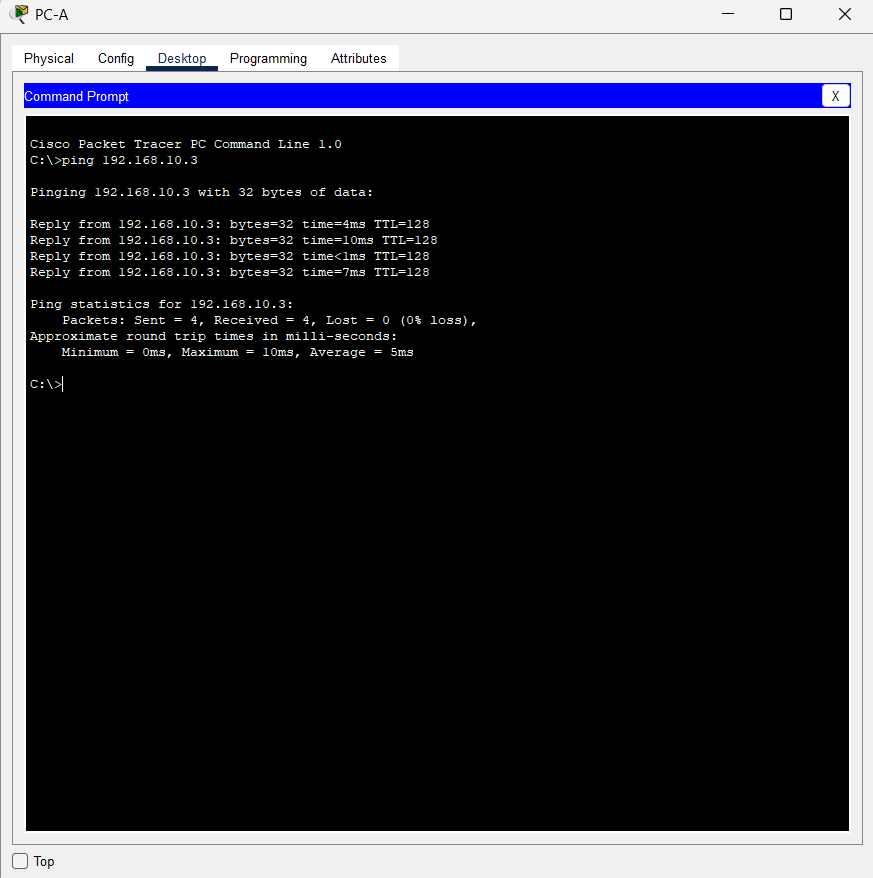
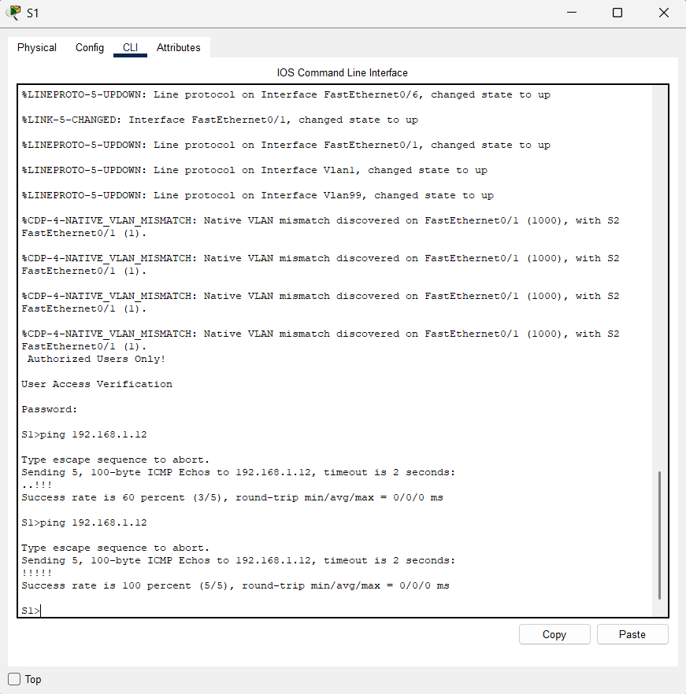

# 🧩 Praktikum Jaringan Komputer - Judul 3

## Configure VLANs and Trunking

### 📘 Deskripsi Singkat

Repository ini dibuat untuk memenuhi tugas akhir praktikum **Jaringan Komputer**, dengan fokus pada **konfigurasi VLAN dan trunking** menggunakan perintah dasar Cisco IOS di Packet Tracer (Physical Mode).
Tujuan dari lab ini adalah untuk membuat VLAN pada masing-masing switch, menghubungkannya menggunakan **trunk 802.1Q**, serta memverifikasi komunikasi antar VLAN.
Melalui praktikum ini, peserta memahami bagaimana VLAN dapat digunakan untuk meningkatkan **keamanan, performa jaringan, serta efisiensi pengelolaan lalu lintas Layer 2**.

---

### ⚙️ Langkah Umum

1. Membangun topologi jaringan sesuai panduan lab.
2. Mengonfigurasi pengaturan dasar pada PC dan switch (hostname, password, banner, IP VLAN 1).
3. Membuat VLAN seperti **Operations, Parking_Lot, Management, dan Native**.
4. Menetapkan port akses untuk setiap VLAN sesuai perangkat yang terhubung.
5. Mengonfigurasi dan memverifikasi **trunk 802.1Q** antar switch.
6. Menguji konektivitas antar host dan antar VLAN.
7. Menampilkan hasil konfigurasi dengan perintah `show vlan brief`, `show interfaces trunk`, dan `show ip interface brief`.

---

### 🧠 Perangkat yang Digunakan

* 2 Switch Cisco 2960 (IOS 15.2)
* 2 PC (Windows / Packet Tracer)
* Kabel konsol & kabel Ethernet (Straight-through)
* Packet Tracer (Physical Mode)

---

### 🔧 VLAN Configuration

| VLAN ID | Nama VLAN   | Fungsi                        |
| :-----: | :---------- | :---------------------------- |
|    10   | Operations  | VLAN untuk PC-A dan PC-B      |
|    20   | Parking_Lot | VLAN tambahan untuk lab       |
|    99   | Management  | VLAN untuk pengelolaan switch |
|   1000  | Native      | VLAN native trunk link        |

---

### 💻 Hasil Praktikum

**1️⃣ Hasil Ping PC**

> 
> PC-A berhasil berkomunikasi dengan PC-B pada VLAN yang sama (VLAN 10).

---

**2️⃣ Hasil Ping Switch**

> 
> Ping antar VLAN (VLAN 10 ↔ VLAN 99) gagal karena tidak adanya **perangkat Layer 3 (router)** yang melakukan routing antar VLAN.

---

### 🎥 Dokumentasi Video

Link YouTube Praktikum: [Klik di sini](https://youtu.be/DlWJ0IRAKXM)

---

### ✍️ Kesimpulan

Dari hasil praktikum, konfigurasi VLAN dan trunk berhasil dilakukan pada dua switch dengan benar.
Koneksi antar perangkat dalam VLAN yang sama berjalan lancar, sementara komunikasi antar VLAN gagal karena tidak adanya inter-VLAN routing.
Praktikum ini memperkuat pemahaman mengenai:

* **Pembuatan dan pengelolaan VLAN**
* **Penggunaan trunk 802.1Q untuk membawa beberapa VLAN melalui satu link**
* **Pentingnya Layer 3 device untuk komunikasi antar VLAN**

Dengan demikian, konsep VLAN dan trunking ini menjadi dasar penting dalam **desain jaringan berskala besar dan aman**.

---

### 📅 Informasi

**Nama Praktikan:** *Cindy Puji Lestari*

**NPM:** *2315061042*

**Mata Kuliah:** Jaringan Komputer

**Praktikum:** Judul 3 - Configure VLANs and Trunking
